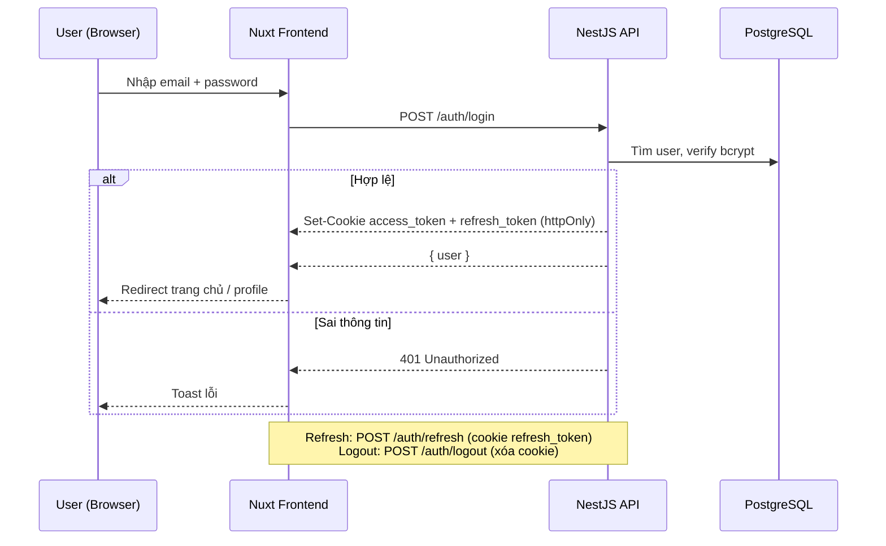
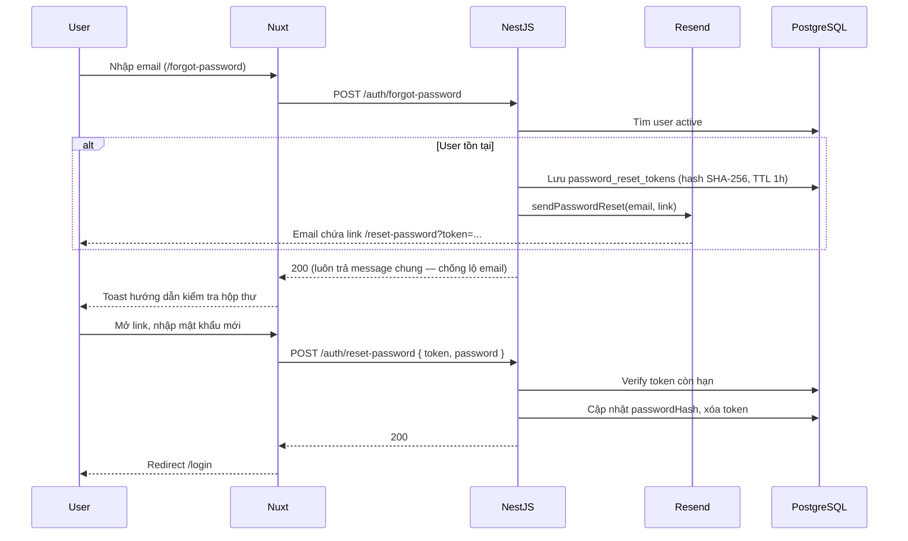
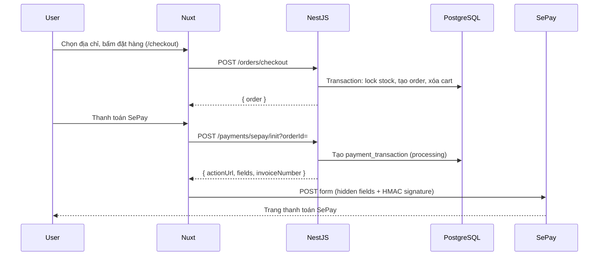
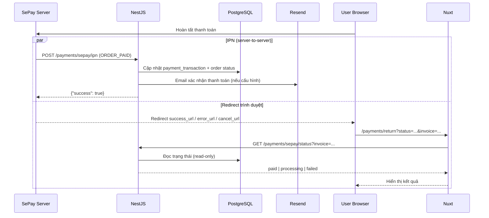
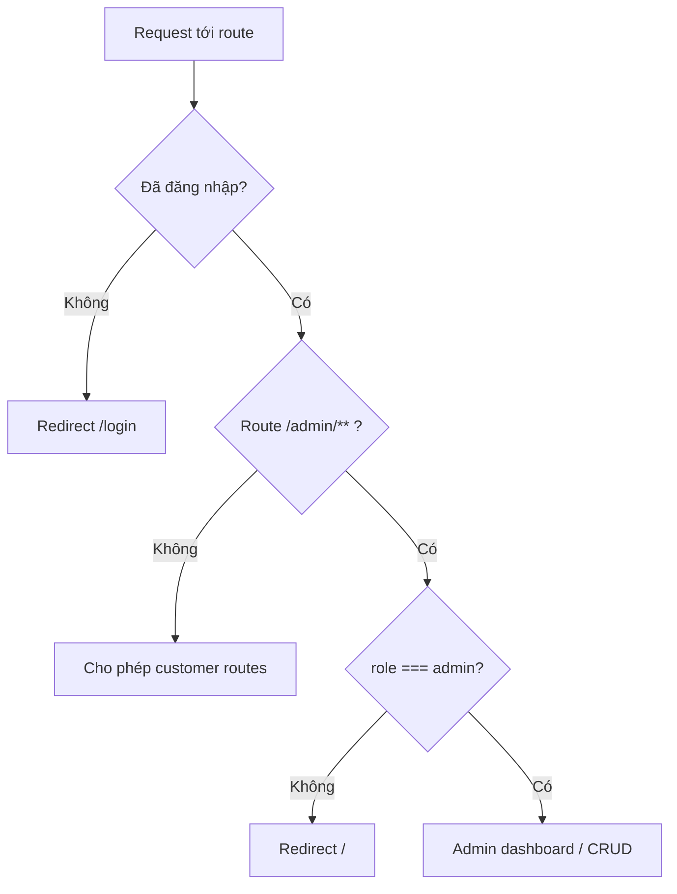

# Luồng nghiệp vụ chính

Tài liệu mô tả các flow cốt lõi của TechShop. Chi tiết API: [API.md](./API.md). Thanh toán SePay: [SEPAY_INTEGRATION.md](./SEPAY_INTEGRATION.md).

---

## 1. Đăng nhập / đăng ký

**Google OAuth:** `GET /auth/google` → Google consent → `GET /auth/google/callback` → set cookie → redirect `FRONTEND_URL/?auth=google`.

---

## 2. Quên mật khẩu / đặt lại mật khẩu

Cấu hình email: [RESEND_INTEGRATION.md](./RESEND_INTEGRATION.md).

---

## 3. Checkout + thanh toán SePay

---

## 4. Webhook IPN SePay (nguồn sự thật cho trạng thái `paid`)

**Lưu ý:** Redirect trình duyệt chỉ để hiển thị. Chỉ IPN mới đánh dấu đơn `paid` trong database.

---

## 5. Phân quyền (RBAC)

Middleware frontend: `auth`, `customer`, `admin`. Backend: `@Roles('admin')` + JWT guard.

---

## Liên kết

| Tài liệu | Nội dung |
|----------|----------|
| [ARCHITECTURE.md](./ARCHITECTURE.md) | Sơ đồ hệ thống tổng quan |
| [SEPAY_INTEGRATION.md](./SEPAY_INTEGRATION.md) | Cấu hình SePay, sandbox, IPN, troubleshooting |
| [TEST_CHECKLIST.md](./TEST_CHECKLIST.md) | Checklist kiểm thử các luồng trên |
